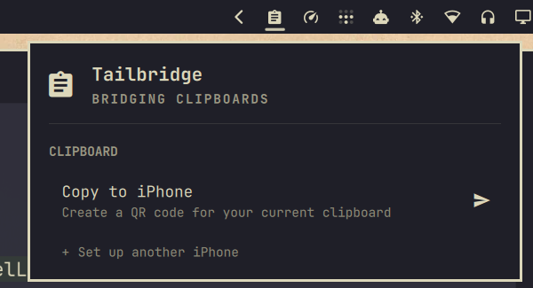
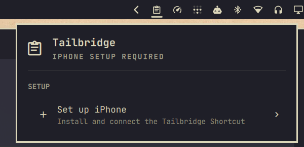
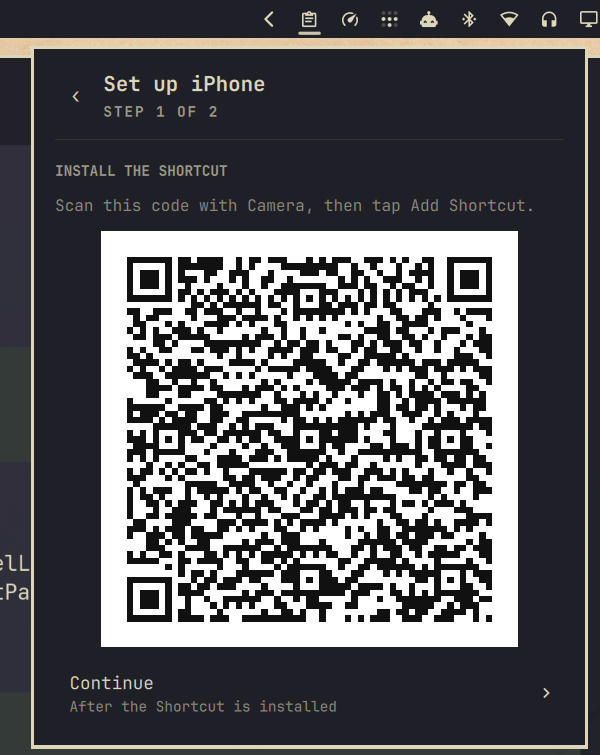
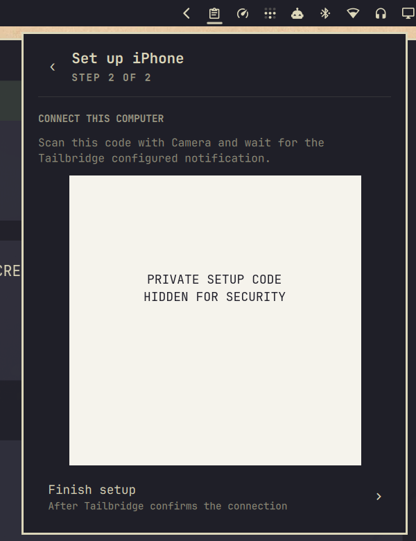
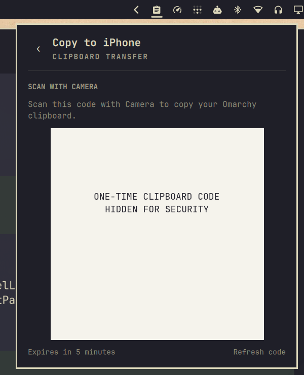

# Tailbridge

Tailbridge moves clipboard content between an iPhone and [Omarchy](https://omarchy.org) over Tailscale. Send from iPhone with the Action Button or Shortcuts, and send from Omarchy with a one-time QR code. No companion iOS app is required beyond Tailscale and Apple's built-in Shortcuts app.



## Requirements

- Omarchy with third-party shell plugin support
- Tailscale connected to the same tailnet on both devices
- Python 3.9 or newer, `wl-clipboard`, `qrencode`, and `setpriv` on Omarchy
- An iPhone with Tailscale, Shortcuts, and iCloud Drive enabled
- Tailnet access from the iPhone to TCP port `45871` on the Omarchy computer

On Omarchy, install any missing system dependencies with:

```bash
sudo pacman -S --needed tailscale python wl-clipboard qrencode util-linux
```

## Install

```bash
omarchy plugin add https://github.com/swheel33/tailbridge.git --enable
```

The widget appears in the right section of the Omarchy bar. Plugins run as unsandboxed user code, so review the source before enabling it.

## Set Up iPhone

1. Open Tailbridge from the Omarchy bar and select **Set up iPhone**.
2. Scan the first QR code with the iPhone Camera, then tap **Add Shortcut**.
3. Return to Tailbridge on Omarchy and select **Continue**.
4. Scan the second QR code and allow it to open the Tailbridge Shortcut.
5. Wait for the `Tailbridge configured` notification. This confirms the Shortcut reached this computer and saved its private inbox URL.
6. Select **Finish setup** on Omarchy.
7. Optionally assign Tailbridge under **Settings > Action Button > Shortcut**. You can also run it from Shortcuts, Siri, Control Center, or another Shortcut trigger.

| First run | Install Shortcut | Connect computer |
| --- | --- | --- |
|  |  |  |

The second QR code contains the computer's private inbox credential. Do not share or publish it.

## Use

### iPhone to Omarchy

1. Copy text, an image, or one file on the iPhone.
2. Press the Action Button or run the Tailbridge Shortcut.
3. After `Copied to Omarchy` appears, paste normally on Omarchy.

### Omarchy to iPhone

1. Copy text, an image, or one local file on Omarchy.
2. Open Tailbridge and select **Copy to iPhone**.
3. Scan the QR code with the iPhone Camera.
4. After `Copied from Omarchy` appears, paste normally on the iPhone.



## Supported Content

- One clipboard item at a time, up to 100 MiB
- UTF-8 plain text and URLs
- Common image formats; iPhone images are converted to PNG
- Videos, audio, PDFs, archives, and other content copied as one local file
- Multiple files and folders are not supported
- Rich text is sent as plain text
- Live Photo motion and some image metadata are not preserved
- No automatic background synchronization

Files received from iPhone are staged under `${XDG_STATE_HOME:-$HOME/.local/state}/omarchy/tailbridge/inbox/`. Save or paste a received file before sending another clipboard item, because the next successful item replaces the staged file.

## Security

- The bridge listens only on the computer's Tailscale IPv4 address. Tailbridge uses HTTP inside Tailscale; Tailscale provides transport encryption.
- The iPhone must be able to reach TCP port `45871`. Tailnet ACLs can restrict that access to the intended iPhone and computer.
- The private inbox URL contains a random credential. It is stored with owner-only permissions on Omarchy and in `iCloud Drive/Shortcuts/Tailbridge.txt` for the Shortcut.
- The public installation Shortcut contains no Tailscale address, credential, or clipboard content. Its source is included as `Tailbridge.cherri`.
- Omarchy-to-iPhone claims expire after five minutes and work once. Refreshing or closing the QR invalidates the previous claim.
- Tailbridge does not maintain clipboard history or HTTP request logs. A separate system clipboard manager may still record clipboard content.
- Tailscale Serve and Funnel are not used.

## Troubleshooting

- **Tailbridge is starting or stopped:** Confirm Tailscale is connected with `tailscale status`, then disable and re-enable the plugin.
- **The iPhone cannot complete setup:** Confirm both devices are on the same tailnet and that tailnet ACLs or the host firewall allow TCP port `45871`.
- **The QR is invalid or expired:** Create a new code. Clipboard QR codes work once and expire after five minutes.
- **The clipboard format is unsupported:** Copy plain text, a supported image, or one local file. Folders and multiple files are not supported.
- **The computer's Tailscale address changed:** Run iPhone setup again.
- **The Shortcut says to install the current version:** Remove the old Tailbridge Shortcut and repeat setup from the Omarchy panel.

The unauthenticated URL `http://<computer-tailscale-ip>:45871/v1/health` returns `{"ok":true}` when the service is reachable. It does not test the private inbox credential.

## Update

```bash
omarchy plugin update swheel33.tailbridge
```

If an update changes `Tailbridge.cherri`, remove the old iPhone Shortcut and run setup again to install the newly published version.

## Reset

Delete `iCloud Drive/Shortcuts/Tailbridge.txt` on the iPhone, then run setup again from the Omarchy panel.

To rotate the computer credential, disable Tailbridge, remove `${XDG_STATE_HOME:-$HOME/.local/state}/omarchy/tailbridge/state.json`, enable the plugin, and run setup again on every iPhone. This immediately invalidates old iPhone configurations.

## Uninstall

```bash
omarchy plugin remove swheel33.tailbridge
rm -rf "${XDG_STATE_HOME:-$HOME/.local/state}/omarchy/tailbridge"
```

Also delete the Tailbridge Shortcut and `iCloud Drive/Shortcuts/Tailbridge.txt` from the iPhone.

## Shortcut Development

`Tailbridge.cherri` is the source for the iPhone Shortcut. Build and sign it on Linux with [Cherri](https://github.com/electrikmilk/cherri):

```bash
cherri Tailbridge.cherri --share=anyone --hubsign
```

Import the resulting `.shortcut` file on an iPhone, duplicate it in Shortcuts, delete the imported original, and rename the native duplicate to Tailbridge. Test that **Always Allow** permissions persist, choose **Copy iCloud Link** from the native duplicate, update `INSTALL_URL` in `bridge.py`, and verify the installation QR before releasing the change. Apple does not provide a supported Linux API for publishing an iCloud Shortcut link.

## License

[MIT](LICENSE)
